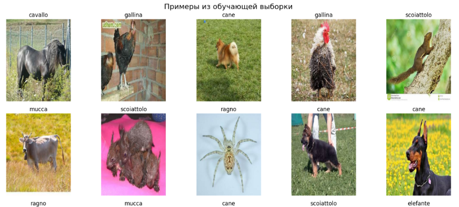
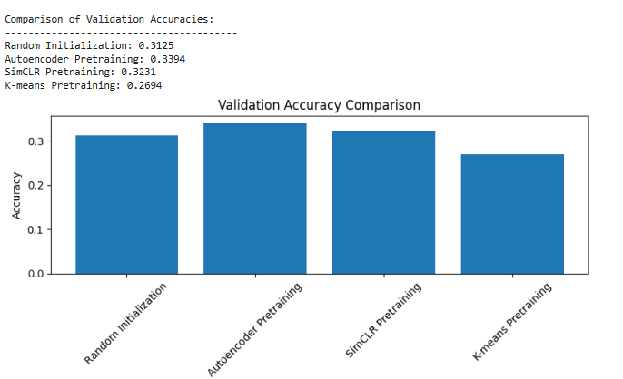

**Лабораторная работа 6**

**Начальная настройка весов сверточных нейронных сетей**

Код [ссылка](lab6.ipynb)

Отчет [ссылка]()

В этом исследовании был проведён эксперимент по предобучению сверточных нейронных сетей с использованием трёх разных способов инициализации: автоэнкодера, SimCLR и k-means. В качестве базовой архитектуры взяли упрощённую модель из оригинальной работы.

Данные [ссылка](https://www.kaggle.com/datasets/alessiocorrado99/animals10/data)

Было создано три варианта предобучения сверточных неронных сетей

